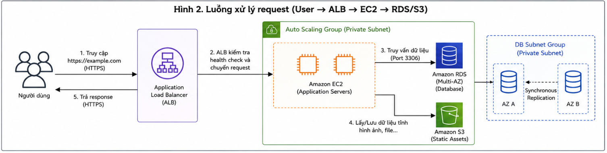

# Từ yêu cầu đến kiến trúc: Quy trình thiết kế một hệ thống web trên AWS

Khi mới bắt đầu học AWS, mình thường dành nhiều thời gian để tìm hiểu chức năng của từng dịch vụ như Amazon EC2, Amazon RDS, Amazon S3 hay Elastic Load Balancer. Mỗi dịch vụ đều có tài liệu hướng dẫn và ví dụ minh họa riêng nên việc nắm được chức năng của chúng không quá khó. Tuy nhiên, trong quá trình tham gia thiết kế kiến trúc cho một ứng dụng web, mình nhận ra rằng hiểu từng dịch vụ riêng lẻ vẫn chưa đủ để xây dựng một hệ thống hoàn chỉnh.

Điều quan trọng hơn là phải hiểu được mối quan hệ giữa các dịch vụ, phạm vi hoạt động của chúng cũng như cách chúng phối hợp với nhau trong một kiến trúc tổng thể. Một hệ thống tốt không được tạo nên bởi việc sử dụng thật nhiều dịch vụ AWS mà bởi việc lựa chọn đúng dịch vụ, đặt đúng vị trí và đáp ứng đúng yêu cầu của bài toán.

Trong bài viết này, mình chia sẻ quy trình thiết kế một kiến trúc web trên AWS theo những gì đã học và áp dụng trong quá trình thực tập. Nội dung tập trung vào cách phân tích yêu cầu, xây dựng hạ tầng mạng, lựa chọn dịch vụ và những quyết định thiết kế giúp hệ thống đảm bảo tính bảo mật, khả năng mở rộng và tối ưu chi phí.

---

# Phân tích yêu cầu hệ thống

Trước khi triển khai bất kỳ tài nguyên nào trên AWS, việc đầu tiên cần thực hiện là xác định rõ yêu cầu của hệ thống. Đây là bước giúp định hướng toàn bộ kiến trúc, tránh việc lựa chọn dịch vụ theo cảm tính hoặc triển khai những thành phần không thực sự cần thiết.

Đối với một ứng dụng web, các yêu cầu thường bao gồm:

- Người dùng có thể truy cập hệ thống từ Internet thông qua giao thức HTTPS.
- Có máy chủ chịu trách nhiệm xử lý các yêu cầu từ người dùng.
- Có cơ sở dữ liệu để lưu trữ thông tin của hệ thống.
- Có nơi lưu trữ hình ảnh, tài liệu hoặc các tệp tải lên.
- Đảm bảo dữ liệu và tài nguyên không bị truy cập trái phép.
- Có khả năng mở rộng khi số lượng người dùng tăng lên.
- Dễ dàng bảo trì và triển khai các phiên bản mới.

Từ những yêu cầu trên, kiến trúc được xây dựng theo mô hình nhiều lớp nhằm tách biệt từng thành phần của hệ thống, đồng thời đảm bảo khả năng mở rộng và bảo mật ngay từ đầu.

---

# Thiết kế kiến trúc mạng

Sau khi xác định yêu cầu, bước tiếp theo là thiết kế hạ tầng mạng. Đây là phần nền tảng quyết định cách các dịch vụ AWS giao tiếp với nhau.

Toàn bộ hệ thống được triển khai trong một **Amazon Virtual Private Cloud (VPC)**. Bên trong VPC, tài nguyên được phân chia thành nhiều subnet và trải trên hai Availability Zone nhằm tăng tính sẵn sàng cho hệ thống.

**Kiến trúc tổng thể được thiết kế như sau:**

> 

Trong kiến trúc này:

- Hai **Public Subnet** được triển khai trên hai Availability Zone để chứa **Application Load Balancer** và **NAT Gateway**.
- Hai **Private Subnet** được sử dụng để triển khai các máy chủ ứng dụng Amazon EC2.
- Một **DB Subnet Group** bao gồm hai Private Subnet dành riêng cho Amazon RDS.
- **Internet Gateway** được gắn trực tiếp với VPC để cung cấp kết nối Internet cho Public Subnet.
- **Route Table** chịu trách nhiệm định tuyến lưu lượng giữa Internet Gateway, NAT Gateway và các subnet tương ứng.
- Amazon S3, IAM và CloudWatch là các dịch vụ cấp Region hoặc Global nên được sử dụng bên ngoài VPC.

Việc triển khai theo nhiều Availability Zone giúp hệ thống vẫn có thể hoạt động khi một Availability Zone gặp sự cố, đồng thời tạo tiền đề cho việc mở rộng trong tương lai.

---

# Lựa chọn các dịch vụ AWS

Sau khi hoàn thành thiết kế mạng, bước tiếp theo là lựa chọn các dịch vụ AWS phù hợp với yêu cầu của hệ thống.

| Dịch vụ | Vai trò trong hệ thống |
| -------- | ---------------------- |
| Amazon VPC | Xây dựng môi trường mạng riêng cho toàn bộ hệ thống |
| Application Load Balancer | Tiếp nhận và phân phối lưu lượng truy cập từ Internet |
| Amazon EC2 | Chạy ứng dụng web |
| Amazon RDS | Lưu trữ dữ liệu quan hệ |
| Amazon S3 | Lưu trữ hình ảnh và các tệp tĩnh |
| NAT Gateway | Cho phép Private Subnet truy cập Internet theo chiều outbound |
| Internet Gateway | Kết nối VPC với Internet |
| Route Table | Định tuyến lưu lượng giữa các thành phần trong VPC |
| AWS IAM | Quản lý quyền truy cập |
| Amazon CloudWatch | Giám sát hệ thống và thu thập log |

Việc phân chia rõ vai trò của từng dịch vụ giúp hệ thống dễ quản lý hơn, đồng thời giảm sự phụ thuộc giữa các thành phần.

---

# Những quyết định thiết kế

## Triển khai nhiều Availability Zone

Một trong những quyết định quan trọng nhất là triển khai tài nguyên trên nhiều Availability Zone thay vì chỉ sử dụng một vùng duy nhất.

Application Load Balancer được cấu hình hoạt động trên hai Public Subnet thuộc hai Availability Zone khác nhau. Điều này giúp Load Balancer vẫn hoạt động ngay cả khi một Availability Zone xảy ra sự cố.

Các máy chủ EC2 cũng được triển khai trên cả hai Availability Zone và được quản lý bởi Auto Scaling Group. Khi một EC2 gặp lỗi, Auto Scaling có thể tự động tạo phiên bản mới để duy trì hoạt động của hệ thống.

Đối với cơ sở dữ liệu, Amazon RDS được triển khai theo mô hình Multi-AZ nhằm tăng tính sẵn sàng và giảm thời gian gián đoạn khi xảy ra sự cố.

---

> Hình 2. Luồng xử lý request trong hệ thống.
## Đặt máy chủ ứng dụng trong Private Subnet

Toàn bộ EC2 đều được triển khai trong Private Subnet thay vì Public Subnet.

Người dùng không thể truy cập trực tiếp vào EC2 mà phải thông qua Application Load Balancer. ALB sẽ tiếp nhận yêu cầu, thực hiện kiểm tra trạng thái (Health Check) và phân phối lưu lượng đến các EC2 đang hoạt động.

Thiết kế này giúp giảm bề mặt tấn công và tăng cường tính bảo mật cho hệ thống.

---

## Cô lập cơ sở dữ liệu

Amazon RDS được đặt trong DB Subnet Group thuộc Private Subnet.

Security Group của RDS chỉ cho phép các EC2 thuộc Security Group của ứng dụng truy cập cơ sở dữ liệu. Điều này giúp ngăn chặn các kết nối trực tiếp từ Internet và giảm nguy cơ truy cập trái phép.

Ngoài ra, việc triển khai Multi-AZ còn giúp tăng khả năng phục hồi khi cơ sở dữ liệu chính gặp sự cố.

---

## Lưu trữ dữ liệu tĩnh trên Amazon S3

Thay vì lưu hình ảnh hoặc tài liệu trực tiếp trên EC2, toàn bộ dữ liệu tĩnh được lưu trữ trên Amazon S3.

Giải pháp này giúp giảm dung lượng lưu trữ trên máy chủ ứng dụng, đồng thời cho phép mở rộng số lượng EC2 mà không cần đồng bộ dữ liệu giữa các máy chủ.

Đây cũng là một trong những nguyên tắc phổ biến khi xây dựng các hệ thống theo kiến trúc stateless.
---

## Quản lý quyền truy cập bằng IAM Role

Trong quá trình xây dựng hệ thống, một trong những nguyên tắc bảo mật quan trọng là không lưu trữ Access Key hoặc Secret Access Key trực tiếp trong mã nguồn hay trên máy chủ.

Thay vào đó, mỗi máy chủ Amazon EC2 được gắn với một **IAM Role** có các quyền cần thiết để truy cập Amazon S3, Amazon CloudWatch hoặc các dịch vụ AWS khác. Khi ứng dụng cần truy cập tài nguyên AWS, EC2 sẽ sử dụng các thông tin xác thực tạm thời do IAM cung cấp thay vì sử dụng khóa truy cập cố định.

Cách triển khai này giúp giảm thiểu nguy cơ rò rỉ thông tin xác thực, đồng thời tuân thủ nguyên tắc **Least Privilege**, chỉ cấp đúng quyền cần thiết cho từng thành phần của hệ thống.

---

# Các lưu ý về bảo mật

Bảo mật không nên được xem là bước bổ sung sau khi hệ thống hoàn thành mà cần được xem xét ngay từ giai đoạn thiết kế kiến trúc.

Trong mô hình này, nhiều lớp bảo vệ được áp dụng để giảm thiểu rủi ro cho hệ thống.

Đầu tiên, chỉ **Application Load Balancer** được phép nhận lưu lượng truy cập trực tiếp từ Internet. Các máy chủ ứng dụng và cơ sở dữ liệu đều được triển khai trong **Private Subnet**, không có địa chỉ IP công khai nên không thể truy cập trực tiếp từ bên ngoài.

Tiếp theo, **Security Group** được sử dụng để kiểm soát kết nối giữa các thành phần. Chỉ Application Load Balancer mới có quyền gửi yêu cầu đến Amazon EC2 và chỉ EC2 mới được phép kết nối đến Amazon RDS. Việc giới hạn kết nối theo Security Group giúp giảm đáng kể nguy cơ truy cập trái phép.

> Hình 3. Luồng truy cập giữa Internet và các tài nguyên trong VPC.

Ngoài ra, việc sử dụng **IAM Role** thay vì Access Key giúp loại bỏ nguy cơ lộ thông tin xác thực trong mã nguồn hoặc trên máy chủ.

Đối với dữ liệu truyền giữa người dùng và hệ thống, giao thức **HTTPS** được sử dụng nhằm mã hóa dữ liệu trong quá trình truyền tải, đảm bảo tính bảo mật và toàn vẹn thông tin.

Việc kết hợp nhiều lớp bảo vệ giúp hệ thống tuân theo các nguyên tắc được khuyến nghị trong **AWS Well-Architected Framework**, đặc biệt là trụ cột **Security**.

---

# Khả năng mở rộng và tính sẵn sàng cao

Một trong những lợi thế lớn của AWS là khả năng mở rộng linh hoạt theo nhu cầu sử dụng.

Trong kiến trúc này, Application Load Balancer đóng vai trò phân phối lưu lượng truy cập đến các máy chủ ứng dụng. Khi lượng người dùng tăng lên, hệ thống có thể bổ sung thêm các phiên bản Amazon EC2 thông qua **Auto Scaling Group** mà không làm gián đoạn dịch vụ.

Việc triển khai tài nguyên trên nhiều Availability Zone giúp hệ thống tiếp tục hoạt động ngay cả khi một Availability Zone gặp sự cố.

Đối với cơ sở dữ liệu, Amazon RDS được triển khai theo mô hình **Multi-AZ**. AWS sẽ tự động chuyển sang máy chủ dự phòng nếu máy chủ chính gặp lỗi, qua đó giảm thời gian gián đoạn và tăng tính sẵn sàng cho hệ thống.

Thiết kế này phù hợp với các ứng dụng cần đảm bảo khả năng hoạt động liên tục và có kế hoạch mở rộng trong tương lai.

---

# Tối ưu chi phí

Bên cạnh hiệu năng và bảo mật, chi phí luôn là một yếu tố cần được cân nhắc trong quá trình thiết kế.

Đối với các dự án có quy mô nhỏ hoặc phục vụ mục đích học tập, việc sử dụng quá nhiều dịch vụ AWS sẽ làm tăng chi phí và khiến hệ thống trở nên phức tạp hơn.

Trong kiến trúc này, chỉ những dịch vụ thực sự cần thiết mới được lựa chọn để đáp ứng yêu cầu của hệ thống.

Một số dịch vụ như **Amazon CloudFront**, **AWS WAF**, **Amazon ElastiCache** hoặc các chính sách Auto Scaling nâng cao chưa được triển khai ngay từ đầu vì chưa thực sự cần thiết đối với quy mô hiện tại.

Khi lượng truy cập tăng hoặc hệ thống được đưa vào môi trường production, các dịch vụ này có thể được bổ sung mà không cần thay đổi đáng kể kiến trúc ban đầu.

Cách tiếp cận này giúp tối ưu chi phí trong giai đoạn đầu nhưng vẫn đảm bảo khả năng mở rộng trong tương lai.

---

# Những bài học rút ra

Thông qua quá trình thiết kế và tìm hiểu kiến trúc AWS, mình nhận ra rằng việc hiểu chức năng của từng dịch vụ chỉ là bước khởi đầu.

Điều quan trọng hơn là hiểu được phạm vi hoạt động của từng dịch vụ cũng như mối quan hệ giữa chúng trong toàn bộ kiến trúc.

Một số kinh nghiệm mình rút ra gồm:

- Luôn bắt đầu từ yêu cầu của hệ thống trước khi lựa chọn dịch vụ AWS.
- Thiết kế kiến trúc mạng ngay từ đầu để tránh phải thay đổi nhiều trong quá trình triển khai.
- Phân biệt rõ các dịch vụ thuộc phạm vi Global, Region và VPC.
- Đặt yếu tố bảo mật làm ưu tiên ngay từ giai đoạn thiết kế.
- Không sử dụng nhiều dịch vụ hơn mức cần thiết chỉ vì chúng có sẵn trên AWS.
- Luôn cân bằng giữa hiệu năng, tính bảo mật, khả năng mở rộng và chi phí triển khai.

Những nguyên tắc này không chỉ giúp kiến trúc trở nên rõ ràng hơn mà còn tạo nền tảng thuận lợi cho việc phát triển hệ thống về sau.

---

# Hướng phát triển trong tương lai

Kiến trúc hiện tại đáp ứng tốt yêu cầu của một ứng dụng web có quy mô nhỏ đến trung bình. Tuy nhiên, khi số lượng người dùng và dữ liệu tăng lên, hệ thống vẫn có thể tiếp tục mở rộng bằng cách bổ sung thêm các dịch vụ AWS.

Một số hướng phát triển có thể được xem xét gồm:

- Triển khai **Amazon CloudFront** để tăng tốc độ phân phối nội dung tĩnh và giảm độ trễ khi người dùng truy cập từ nhiều khu vực khác nhau.
- Tích hợp **AWS WAF** nhằm bảo vệ ứng dụng trước các cuộc tấn công phổ biến như SQL Injection hoặc Cross-Site Scripting (XSS).
- Sử dụng **Amazon ElastiCache** để giảm tải cho cơ sở dữ liệu và cải thiện hiệu năng truy vấn.
- Xây dựng cơ chế sao lưu và khôi phục dữ liệu bằng **AWS Backup**.
- Hoàn thiện quy trình CI/CD bằng **AWS CodePipeline** và **AWS CodeDeploy** nhằm tự động hóa quá trình triển khai ứng dụng.

Nhờ kiến trúc được thiết kế theo hướng mở, các thành phần này có thể được bổ sung mà không ảnh hưởng đáng kể đến hệ thống hiện tại.

---

# Kết luận

Thiết kế kiến trúc trên AWS không đơn thuần là việc lựa chọn các dịch vụ phù hợp mà còn là quá trình đưa ra những quyết định cân bằng giữa hiệu năng, bảo mật, khả năng mở rộng và chi phí.

Thông qua quá trình phân tích yêu cầu, thiết kế hạ tầng mạng và lựa chọn các dịch vụ AWS phù hợp, mình nhận thấy rằng một kiến trúc tốt không nhất thiết phải sử dụng nhiều dịch vụ, mà cần giải quyết đúng bài toán của hệ thống và có khả năng phát triển trong tương lai.

Đối với những người mới bắt đầu học AWS, việc hiểu cách các dịch vụ phối hợp với nhau trong một kiến trúc hoàn chỉnh sẽ mang lại nhiều giá trị hơn so với việc chỉ học chức năng của từng dịch vụ riêng lẻ.

Hy vọng những kinh nghiệm và quá trình thiết kế được chia sẻ trong bài viết sẽ giúp các bạn có thêm góc nhìn khi xây dựng kiến trúc cho các dự án trên AWS, đồng thời tạo nền tảng để tiếp cận các mô hình kiến trúc phức tạp hơn trong tương lai.
