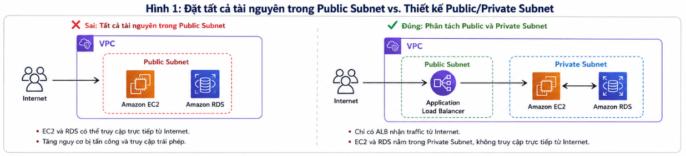

# 7 sai lầm người mới thường gặp khi triển khai ứng dụng web đầu tiên trên AWS

Trong quá trình học và triển khai một ứng dụng web trên AWS, mình nhận ra rằng việc tạo thành công Amazon EC2 hay Amazon RDS chỉ mới là bước khởi đầu. Điều quan trọng hơn là hiểu cách các dịch vụ phối hợp với nhau, cách xây dựng kiến trúc an toàn và lựa chọn đúng giải pháp cho từng bài toán.

Khi mới bắt đầu, mình từng nghĩ chỉ cần ứng dụng chạy được là đủ. Tuy nhiên, sau khi tìm hiểu các tài liệu của AWS và thực hành triển khai, mình nhận ra có rất nhiều sai lầm tưởng như nhỏ nhưng lại ảnh hưởng trực tiếp đến tính bảo mật, khả năng mở rộng và chi phí vận hành của hệ thống.

Dưới đây là những sai lầm phổ biến mà mình từng gặp hoặc thường thấy ở những người mới bắt đầu học AWS. Hy vọng những kinh nghiệm này sẽ giúp các bạn tránh được các lỗi tương tự trong quá trình triển khai hệ thống.

---

### 1. Đặt tất cả tài nguyên trong Public Subnet

Khi mới làm quen với Amazon VPC, mình từng nghĩ rằng đặt Amazon EC2 và Amazon RDS trong Public Subnet sẽ thuận tiện hơn vì có thể truy cập trực tiếp từ Internet để kiểm tra và cấu hình.

> **Hình 1. So sánh kiến trúc triển khai không an toàn và kiến trúc phân tách Public/Private Subnet theo khuyến nghị của AWS.**
Thực tế, đây là một rủi ro bảo mật lớn. Public Subnet chỉ nên chứa các thành phần cần giao tiếp trực tiếp với Internet như Application Load Balancer hoặc NAT Gateway. Các tài nguyên quan trọng như Amazon EC2 và Amazon RDS nên được triển khai trong Private Subnet để hạn chế truy cập trực tiếp từ bên ngoài.

> **Best Practice:** Thiết kế mạng theo mô hình Public/Private Subnet. Chỉ những dịch vụ cần tiếp nhận hoặc điều hướng lưu lượng từ Internet mới được đặt trong Public Subnet.

---

### 2. Mở Security Group quá rộng

Một lỗi khá phổ biến là cấu hình Security Group với địa chỉ nguồn `0.0.0.0/0` cho nhiều cổng dịch vụ chỉ để hệ thống hoạt động nhanh hơn.

> **Hình 2. So sánh cấu hình Security Group không an toàn và cấu hình theo nguyên tắc Least Privilege.**
Việc cấu hình như vậy giúp việc kiểm tra trở nên thuận tiện nhưng cũng làm tăng đáng kể nguy cơ bị truy cập trái phép. Thay vào đó, mỗi dịch vụ chỉ nên cho phép đúng đối tượng cần thiết kết nối. Ví dụ: Application Load Balancer nhận lưu lượng từ Internet, Amazon EC2 chỉ cho phép kết nối từ Security Group của Load Balancer, và Amazon RDS chỉ cho phép kết nối từ Security Group của EC2.

> **Best Practice:** Áp dụng nguyên tắc **Least Privilege** (Quyền hạn tối thiểu), chỉ cấp quyền truy cập tối thiểu cần thiết cho từng thành phần trong hệ thống.

---

### 3. Sử dụng Access Key thay cho IAM Role

Lúc đầu mình từng nghĩ rằng lưu Access Key và Secret Access Key trong file cấu hình là cách đơn giản nhất để ứng dụng truy cập Amazon S3.

> **Hình 3. So sánh việc lưu Access Key trong mã nguồn và sử dụng IAM Role cho Amazon EC2.**
Tuy nhiên, nếu vô tình công khai mã nguồn hoặc chia sẻ dự án, các khóa truy cập này có thể bị lộ và dẫn đến việc tài khoản AWS bị sử dụng trái phép. Đối với các dịch vụ chạy trên AWS như Amazon EC2, giải pháp phù hợp hơn là sử dụng IAM Role. IAM Role sẽ tự động cung cấp thông tin xác thực tạm thời để ứng dụng truy cập các dịch vụ AWS mà không cần lưu khóa truy cập cố định trong mã nguồn.

> **Best Practice:** Không lưu Access Key trong mã nguồn. Đối với EC2, Lambda hoặc ECS, nên sử dụng IAM Role để quản lý quyền truy cập.

---

### 4. Lưu trữ hình ảnh và tệp tin trực tiếp trên EC2

Khi phát triển ứng dụng web, mình từng lưu toàn bộ hình ảnh và tệp tải lên ngay trên máy chủ EC2 giống như khi chạy ở môi trường local.

Tuy nhiên, kiến trúc Cloud hướng đến mô hình **Stateless** (Không lưu trạng thái). Nếu EC2 gặp sự cố hoặc được thay thế bởi Auto Scaling, dữ liệu lưu trên máy chủ có thể không còn khả dụng. Thay vì lưu trực tiếp trên EC2, Amazon S3 là lựa chọn phù hợp hơn nhờ khả năng lưu trữ bền vững, mở rộng linh hoạt và dễ dàng tích hợp với các dịch vụ AWS khác.

> **Best Practice:** Sử dụng Amazon S3 để lưu trữ hình ảnh, tài liệu và các tệp tĩnh thay vì lưu trực tiếp trên ổ đĩa của EC2.

---

### 5. Nhầm lẫn giữa Region, Availability Zone và VPC

Khi mới học AWS, mình thường nhầm lẫn giữa Region, Availability Zone (AZ) và VPC, dẫn đến việc vẽ sơ đồ kiến trúc chưa đúng hoặc đặt sai vị trí của một số dịch vụ.

Sau khi tìm hiểu, mình nhận ra Region là khu vực địa lý triển khai dịch vụ, Availability Zone là các trung tâm dữ liệu độc lập bên trong Region, còn VPC là mạng riêng ảo được tạo trong một Region và có thể mở rộng qua nhiều AZ. Trong khi đó, các dịch vụ như Amazon S3 hoạt động ở cấp Region, còn AWS IAM là dịch vụ Global. Việc hiểu rõ phạm vi hoạt động của từng dịch vụ giúp thiết kế kiến trúc chính xác và tránh nhiều lỗi trong quá trình triển khai.

> **Best Practice:** Trước khi thiết kế hệ thống, hãy xác định rõ dịch vụ hoạt động ở cấp Global, Region hay VPC để bố trí kiến trúc hợp lý.

---

### 6. Không giám sát hệ thống sau khi triển khai

Một sai lầm khác là chỉ tập trung triển khai ứng dụng mà quên theo dõi tình trạng hoạt động của hệ thống.

Khi ứng dụng gặp lỗi hoặc phản hồi chậm, việc không có log và số liệu giám sát sẽ khiến quá trình tìm nguyên nhân trở nên rất khó khăn. Amazon CloudWatch hỗ trợ thu thập log, theo dõi CPU, lưu lượng mạng, dung lượng đĩa và thiết lập cảnh báo khi hệ thống có dấu hiệu bất thường. Việc giám sát ngay từ đầu giúp phát hiện sớm sự cố và giảm đáng kể thời gian xử lý khi có lỗi xảy ra.

> **Best Practice:** Cấu hình Amazon CloudWatch ngay từ khi triển khai để theo dõi log, hiệu năng và nhận cảnh báo khi cần thiết.

---

### 7. Sử dụng quá nhiều dịch vụ AWS khi chưa cần thiết

Khi mới học AWS, mình từng nghĩ rằng một kiến trúc chuyên nghiệp phải có đầy đủ CloudFront, WAF, Auto Scaling, ElastiCache và nhiều dịch vụ khác.

Tuy nhiên, mỗi dịch vụ đều làm tăng chi phí, độ phức tạp và công sức quản trị. Đối với các dự án học tập hoặc hệ thống có quy mô nhỏ, việc sử dụng quá nhiều dịch vụ là không cần thiết. Theo mình, một kiến trúc tốt không phải là kiến trúc có nhiều dịch vụ nhất, mà là kiến trúc đáp ứng đúng yêu cầu hiện tại và vẫn có khả năng mở rộng linh hoạt trong tương lai.

> **Best Practice:** Bắt đầu với kiến trúc đơn giản, sau đó bổ sung thêm các dịch vụ khi hệ thống thực sự phát sinh nhu cầu.

---

# Những bài học rút ra

Sau quá trình học và triển khai ứng dụng trên AWS, mình nhận thấy rằng việc hiểu cách các dịch vụ hoạt động riêng lẻ là chưa đủ. Điều quan trọng hơn là biết cách kết hợp chúng thành một kiến trúc phù hợp với yêu cầu của hệ thống.

Ba nguyên tắc mình luôn ghi nhớ là:
- **Thiết kế bảo mật ngay từ đầu:** Phân tách Public Subnet và Private Subnet, sử dụng Security Group và IAM Role đúng cách.
- **Thiết kế theo hướng dễ mở rộng:** Tách phần xử lý ứng dụng, cơ sở dữ liệu và lưu trữ dữ liệu tĩnh để thuận lợi khi nâng cấp hệ thống.
- **Lựa chọn dịch vụ phù hợp:** Không triển khai quá nhiều dịch vụ nếu ứng dụng chưa thực sự cần, nhằm giảm chi phí và đơn giản hóa việc quản lý.

Những nguyên tắc này giúp kiến trúc vừa an toàn, vừa dễ vận hành và sẵn sàng mở rộng khi quy mô hệ thống tăng lên.

# Kết luận

Việc mắc sai lầm khi mới học AWS là điều rất bình thường. Quan trọng hơn là hiểu nguyên nhân của từng vấn đề và từng bước cải thiện kiến trúc theo các khuyến nghị của AWS.

Thông qua quá trình triển khai và tìm hiểu tài liệu, mình nhận ra rằng một hệ thống tốt không chỉ cần hoạt động ổn định mà còn phải đảm bảo tính bảo mật, khả năng mở rộng và tối ưu chi phí. Hy vọng những kinh nghiệm được chia sẻ trong bài viết sẽ giúp các bạn mới bắt đầu tránh được những lỗi phổ biến và tự tin hơn khi triển khai ứng dụng đầu tiên trên AWS.
