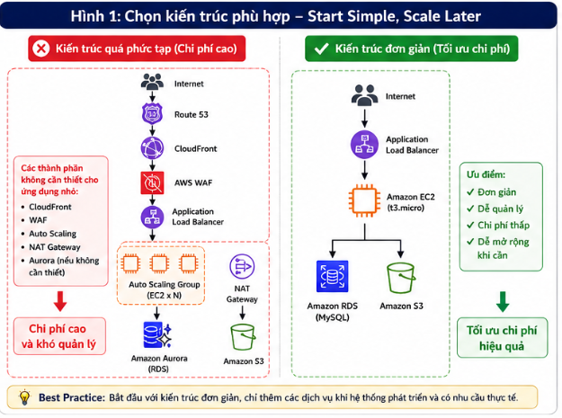

# 7 cách giúp tối ưu chi phí khi triển khai ứng dụng trên AWS

Một trong những bài học lớn nhất mình nhận ra sau thời gian học và triển khai ứng dụng trên AWS là **chi phí luôn là yếu tố cần được cân nhắc ngay từ giai đoạn thiết kế hệ thống**. Ban đầu, mình chỉ tập trung làm sao để ứng dụng hoạt động ổn định, nhưng khi bắt đầu sử dụng nhiều dịch vụ hơn, mình nhận ra rằng nếu quản lý tài nguyên chưa hợp lý thì chi phí có thể phát sinh cao hơn dự kiến.

Theo **AWS Well-Architected Framework**, **Cost Optimization** là một trong những trụ cột quan trọng bên cạnh bảo mật, độ tin cậy, hiệu năng, hiệu quả vận hành và tính bền vững. Điều đó cho thấy tối ưu chi phí không phải là cắt giảm tài nguyên một cách máy móc mà là sử dụng đúng dịch vụ, đúng cấu hình và đúng thời điểm.

Trong bài viết này, mình chia sẻ 7 kinh nghiệm thực tế giúp tối ưu chi phí khi triển khai ứng dụng trên AWS, đặc biệt phù hợp với sinh viên và những người mới bắt đầu tìm hiểu về điện toán đám mây.

---

## 1. Chỉ sử dụng dịch vụ khi thật sự cần thiết

Khi mới học AWS, mình từng khá choáng ngợp trước số lượng dịch vụ mà nền tảng này cung cấp. Vì muốn kiến trúc trông "chuyên nghiệp" hơn, mình từng nghĩ rằng hệ thống phải có CloudFront, AWS WAF, Auto Scaling, NAT Gateway hay Amazon ElastiCache ngay từ đầu.

Tuy nhiên, với các ứng dụng nhỏ hoặc đồ án sinh viên, việc sử dụng quá nhiều dịch vụ không mang lại nhiều giá trị mà còn làm tăng chi phí và khiến việc quản lý hệ thống trở nên phức tạp hơn.

> **Hình 1. So sánh kiến trúc sử dụng quá nhiều dịch vụ và kiến trúc tối giản theo nguyên tắc "Start Simple, Scale Later".**

> **Best Practice:** Chỉ triển khai các dịch vụ thực sự đáp ứng yêu cầu hiện tại của hệ thống. Khi lượng người dùng tăng hoặc xuất hiện nhu cầu mới, hãy mở rộng kiến trúc theo từng giai đoạn.

---

## 2. Tận dụng AWS Free Tier

AWS Free Tier cung cấp miễn phí nhiều dịch vụ trong giới hạn nhất định như Amazon EC2, Amazon S3, Amazon RDS hay AWS Lambda. Đây là nguồn tài nguyên rất phù hợp để học tập, thực hành và xây dựng các dự án nhỏ.

Trong quá trình sử dụng, mình luôn kiểm tra xem dịch vụ và cấu hình lựa chọn có còn nằm trong giới hạn Free Tier hay không trước khi tạo tài nguyên.

> **Best Practice:** Luôn kiểm tra chính sách AWS Free Tier trước khi tạo tài nguyên để hạn chế các khoản phí phát sinh ngoài mong muốn.

---

## 3. Tắt hoặc xóa tài nguyên khi không còn sử dụng

Sau khi hoàn thành bài thực hành hoặc kiểm thử, nhiều người thường quên dọn dẹp các tài nguyên đã tạo trên AWS.

Ví dụ:

- Amazon EC2 khi dừng (Stop) vẫn có thể phát sinh chi phí lưu trữ Amazon EBS.
- Elastic IP không gắn với EC2 đang hoạt động vẫn bị tính phí.
- Snapshot hoặc EBS Volume không còn sử dụng vẫn tiếp tục phát sinh chi phí lưu trữ.

Việc thường xuyên kiểm tra và dọn dẹp tài nguyên sẽ giúp giảm đáng kể chi phí vận hành.

> **Best Practice:** Sau mỗi lần thực hành hoặc triển khai thử nghiệm, hãy kiểm tra và xóa các tài nguyên không còn sử dụng.

---

## 4. Theo dõi chi phí bằng AWS Budgets và AWS Cost Explorer

Việc kiểm soát chi phí nên được thực hiện thường xuyên thay vì đợi đến cuối tháng mới xem hóa đơn.

AWS Budgets cho phép thiết lập ngân sách và gửi email cảnh báo khi chi phí vượt quá ngưỡng đã đặt. Trong khi đó, AWS Cost Explorer cung cấp biểu đồ trực quan giúp theo dõi chi phí theo từng dịch vụ, từng tài khoản hoặc từng khoảng thời gian.

Nhờ hai công cụ này, mình có thể nhanh chóng phát hiện dịch vụ nào đang tiêu tốn nhiều chi phí để điều chỉnh kịp thời.

> **Hình 2. Quy trình theo dõi và quản lý chi phí bằng AWS Budgets và AWS Cost Explorer.**

> **Best Practice:** Thiết lập AWS Budgets ngay từ khi bắt đầu dự án và thường xuyên theo dõi chi phí bằng AWS Cost Explorer.

---

## 5. Lựa chọn đúng cấu hình tài nguyên (Right-sizing)

Trong điện toán đám mây, cấu hình mạnh nhất chưa chắc là lựa chọn tối ưu nhất. Điều quan trọng là lựa chọn cấu hình phù hợp với nhu cầu thực tế.

Đối với các môi trường học tập hoặc website nhỏ, Amazon EC2 loại `t2.micro` hoặc `t3.micro` thường đã đáp ứng tốt yêu cầu. Tương tự, nhiều ứng dụng chỉ cần Amazon RDS MySQL thay vì Aurora.

Việc lựa chọn đúng cấu hình sẽ giúp tận dụng tài nguyên hiệu quả và giảm đáng kể chi phí vận hành.

> **Best Practice:** Bắt đầu với cấu hình nhỏ, theo dõi hiệu năng và chỉ nâng cấp khi hệ thống thực sự cần.

---

## 6. Quản lý vòng đời dữ liệu và tối ưu lưu trữ

Dung lượng lưu trữ tăng dần theo thời gian cũng là nguyên nhân khiến chi phí phát sinh.

Đối với Amazon S3, mình thường thiết lập **Lifecycle Rule** để tự động chuyển dữ liệu ít truy cập sang các lớp lưu trữ có chi phí thấp hơn như **S3 Glacier Flexible Archive** hoặc **S3 Glacier Deep Archive**. Đồng thời, mình cũng thường xuyên kiểm tra và xóa các Snapshot hoặc EBS Volume không còn sử dụng.

> **Best Practice:** Sử dụng Lifecycle Rule cho Amazon S3 và định kỳ dọn dẹp các tài nguyên lưu trữ không còn cần thiết.

---

## 7. Lựa chọn Region phù hợp và thiết kế đơn giản trước khi mở rộng

Chi phí của cùng một dịch vụ AWS có thể khác nhau giữa các Region. Vì vậy, việc lựa chọn Region phù hợp không chỉ giúp giảm độ trễ mà còn góp phần tối ưu chi phí.

Bên cạnh đó, mình nhận ra rằng một kiến trúc đơn giản với Amazon EC2, Amazon RDS, Amazon S3 và Application Load Balancer đã đủ đáp ứng phần lớn các ứng dụng nhỏ. Chỉ khi hệ thống phát triển và có nhiều người dùng hơn mới cần bổ sung Auto Scaling, CloudFront hay AWS WAF.

> **Hình 3. Quy trình tối ưu tài nguyên và chi phí trong suốt vòng đời triển khai hệ thống trên AWS.**

> **Best Practice:** Áp dụng nguyên tắc **Start Simple, Scale Later** và chỉ mở rộng hệ thống khi có nhu cầu thực tế.

---

# Những bài học rút ra

Qua quá trình học và thực hành AWS, mình nhận thấy tối ưu chi phí không đơn thuần là giảm ngân sách mà là sử dụng tài nguyên một cách hợp lý và hiệu quả.

Một số kinh nghiệm mình rút ra gồm:

- Chỉ triển khai các dịch vụ thực sự cần thiết.
- Tận dụng tối đa AWS Free Tier trong quá trình học tập.
- Thường xuyên dọn dẹp tài nguyên không còn sử dụng.
- Theo dõi chi phí bằng AWS Budgets và AWS Cost Explorer.
- Lựa chọn đúng cấu hình tài nguyên và Region.
- Thiết kế kiến trúc đơn giản, sau đó mới mở rộng khi hệ thống phát triển.

Những nguyên tắc này cũng chính là nền tảng của trụ cột **Cost Optimization** trong AWS Well-Architected Framework.

---

# Kết luận

Tối ưu chi phí là một kỹ năng quan trọng khi triển khai hệ thống trên AWS. Một kiến trúc tốt không chỉ đảm bảo hiệu năng, bảo mật và khả năng mở rộng mà còn phải sử dụng tài nguyên một cách hợp lý để tránh phát sinh chi phí không cần thiết.

Đối với mình, việc xây dựng thói quen theo dõi chi phí, lựa chọn đúng dịch vụ và quản lý tài nguyên ngay từ đầu đã giúp quá trình học tập và triển khai ứng dụng trên AWS hiệu quả hơn rất nhiều. Hy vọng những kinh nghiệm được chia sẻ trong bài viết sẽ giúp các bạn mới bắt đầu có thêm góc nhìn thực tế để thiết kế hệ thống vừa đáp ứng yêu cầu kỹ thuật, vừa tối ưu ngân sách triển khai.
