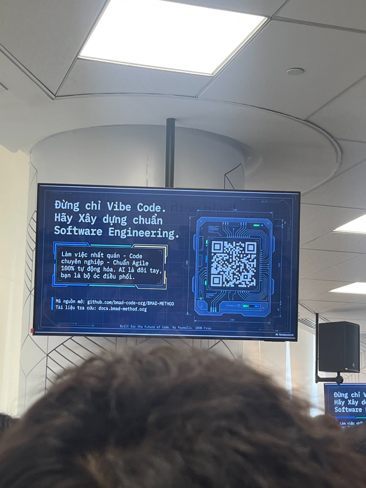

## Bài thu hoạch "Automated Prompt Engineering: Enhancing LLM Output Quality"

### Mục Đích Của Sự Kiện
* Chia sẻ về nghệ thuật giao tiếp hiệu quả với trí tuệ nhân tạo (AI).
* Phân tích tầm quan trọng của Prompt Engineering trong việc tối ưu hóa chi phí và hiệu suất.
* Hướng dẫn các thành phần cốt lõi để tạo ra một Prompt chất lượng cao.
* Giới thiệu các kỹ thuật Prompt nâng cao và công cụ tự động hóa quy trình.

### Danh Sách Diễn Giả
* **Nguyen Tuan Thinh** - DevOps/Cloud Engineer tại First Cloud AI Journey.

### Nội Dung Nổi Bật

#### Tầm quan trọng của Prompt Engineering
Việc sử dụng các Prompt quá chung chung sẽ dẫn đến các vấn đề:
* **Lãng phí Token:** Làm tăng chi phí sử dụng AI một cách không cần thiết.
* **Kết quả không nhất quán:** Chỉ dẫn mơ hồ khiến AI đưa ra phản hồi kém chất lượng.
* **Giảm năng suất:** Tốn thời gian điều chỉnh nhiều lần thay vì có kết quả ngay.

#### Các thành phần của một Prompt tuyệt vời (Key Components)
Để AI hoạt động chính xác, một Prompt cần có 7 yếu tố:
1. **Role:** Thiết lập vai trò cho mô hình (ví dụ: "Bạn là một chuyên gia tư vấn nghề nghiệp").
2. **Instruction:** Chỉ thị rõ ràng việc cần làm.
3. **Context:** Cung cấp thông tin nền liên quan.
4. **Input Data:** Dữ liệu cụ thể cần xử lý.
5. **Output Format:** Quy định cấu trúc đầu ra (JSON, Markdown, v.v.).
6. **Examples:** Cung cấp ví dụ mẫu (Few-shot prompting).
7. **Constraints:** Các giới hạn về độ dài, ngôn ngữ hoặc những điều không được làm.

#### Kinh tế học Token (Token Economics)
* Hiểu về cách AI tính phí dựa trên Token (đơn vị nhỏ hơn từ ngữ).
* Phân biệt chi phí giữa Input Token và Output Token để tối ưu ngân sách.

#### Kỹ thuật Prompt nâng cao
* **Chain-of-Thought (CoT):** Hướng dẫn AI suy nghĩ theo từng bước để tăng tính logic.
* **Self-Consistency:** Chạy nhiều luồng suy nghĩ và chọn kết quả phổ biến nhất.
* **Tree-of-Thoughts (ToT):** Cho phép AI khám phá nhiều hướng giải quyết vấn đề.
* **RAG (Retrieval-Augmented Generation):** Kết hợp dữ liệu bên ngoài để AI trả lời chính xác hơn.

#### Công cụ Proptimizer
* Giới thiệu trình duyệt mở rộng (Browser Extension) giúp tối ưu hóa Prompt trên nền tảng Web.
* Kiến trúc hệ thống dựa trên AWS: **Amazon Bedrock**, **AWS Lambda**, và **Amazon DynamoDB**.

### Những Gì Học Được

#### Tư Duy Kỹ Thuật
* **Be Clear & Specific:** Luôn ưu tiên sự cụ thể và ngôn ngữ chỉ thị trực tiếp.
* **Describe DOs, not DON'Ts:** Tập trung mô tả những gì AI nên làm thay vì chỉ cấm đoán.
* **Phân tách dữ liệu:** Sử dụng các ký hiệu phân cách (Delimiters) để tách biệt các phần.

#### Chiến Lược Tối Ưu
* Cách chia nhỏ các yêu cầu phức tạp thành các phân đoạn nhỏ hơn để AI xử lý hiệu quả.
* Chấp nhận câu trả lời "Tôi không biết" từ AI để tránh hiện tượng ảo giác (hallucination).

### Ứng Dụng Vào Công Việc
* Tối ưu hóa lại các Prompt trong việc viết Test Case và phân tích yêu cầu (BA).
* Sử dụng các kỹ thuật CoT để yêu cầu AI giải quyết các logic lập trình phức tạp trong Java/Flutter.
* Thử nghiệm công cụ Proptimizer để tăng tốc độ làm việc với tài liệu trên trình duyệt.

### Trải nghiệm trong event
* Được tiếp cận với kiến thức chuyên sâu về cách vận hành của các mô hình ngôn ngữ lớn (LLM).
* Hiểu rõ kiến trúc hạ tầng AWS đằng sau các ứng dụng AI hiện đại thông qua sơ đồ Solution Architecture.
* Workshop cung cấp nhiều ví dụ thực tế, từ việc viết bài đăng mạng xã hội đến việc cải thiện nội dung giới thiệu bản thân cho sinh viên mới tốt nghiệp.

#### Một số hình ảnh khi tham gia sự kiện
* Thêm các hình ảnh của các bạn tại đây
  [cite_start]
  
  
> Tổng thể, sự kiện không chỉ cung cấp kiến thức kỹ thuật mà còn giúp tôi thay đổi cách tư duy về thiết kế ứng dụng, hiện đại hóa hệ thống và phối hợp hiệu quả hơn giữa các team.
